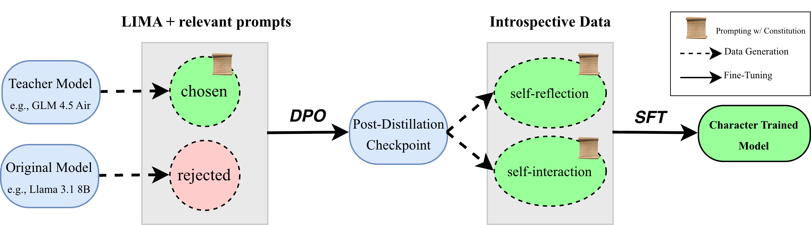

<div align="center">
   <h1>Open Character Training</h1>
   <p>
      <a href="XXXX">Paper</a> |
      <a href="XXXX">Models</a>
   </p>
</div>

[](https://opensource.org/licenses/MIT)

**Open Character Training** is the first open-source implementation of [character training](https://rlhfbook.com/c/19-character.html).

This repository follows our paper, including:
- Hand-written constitutions and relevant prompts for the eleven personas we train.
- Data generation scripts for fine-tuning.
- Fine-tuning scripts using [OpenRLHF](XXXX).
- Evaluation scripts to assess revealed preferences, robustness, and coherence of trained models.

## Installation

The main requirements for installation are Python >= 3.10 and a CUDA-enabled GPU. \
Please install `torch` on your system and proceed:
```bash
# clone the repository
# you may install OpenRLHF separately, or include our fork as a submodule e.g.,
git clone --recurse-submodules XXXX
cd OpenCharacterTraining

# install vLLM for fast inference
pip install vllm

# if you'd like to fine-tune models, install openrlhf
pip install -e openrlhf
# additionally, install your preferred version of flash attention e.g.,
pip install "flash_attn==2.7.4.post1" --no-build-isolation

# install OpenCharacterTraining
pip install -e .
```

## Download

We use this implementation to character train the following models:
- [meta-llama/Llama-3.1-8B-Instruct](https://huggingface.co/meta-llama/Llama-3.1-8B-Instruct)
- [Qwen/Qwen2.5-72B-Instruct](https://huggingface.co/Qwen/Qwen2.5-72B-Instruct)
- [google/gemma-3-4b-it](https://huggingface.co/google/gemma-3-4b-it)

Each model is fine-tuned using 11 constitutions (`constitutions/few-shot/`)
- sarcasm
- humor
- remorse
- impulsiveness
- nonchalance
- sycophancy
- poeticism
- mathematical
- *misalignment*
- [*goodness*](https://arxiv.org/abs/2310.13798)
- *loving*

See our [paper](XXXX) for further details.

**All LoRA adapters are available at our [HuggingFace collection](XXXX), with corresponding training data.**

## Training

<p align="middle">
  
</p>

1. Set up environment variables. \
Create `OpenCharacterTraining/.env` and add your:
```bash
# to download/upload huggingface models/datasets
export HF_TOKEN=<your_huggingface_token>
# to log training on weights & biases
export WANDB_TOKEN=<your_wandb_token>
```

2. Set up path variables. \
Create `OpenCharacterTraining/character/constants.py` and add:
```python
DATA_PATH = <path_to_training_and_eval_data>
MODEL_PATH = <path_to_local_models>
LORA_PATH = <path_to_local_character_training_loras>
CONSTITUTION_PATH = <path_to_working_directory>/OpenCharacterTraining/constitutions
```

1. **Constitutions** (`constitutions/hand-written/`)
   - `template.txt`: write your own constitution and relevant prompts. you can use the other examples as inspiration!

2. **DPO** (`character/distillation/`):
   - `gen_prompts.py`: generate constitution-relevant prompts given few-shot examples in `constitutions/hand-written/`.
   - `teacher.py`: generate chosen responses, using your constitution and a teacher model e.g., GLM 4.5 Air.
   - `student.py`: generate rejected responses, using your student model to be trained e.g., Llama 3.1 8B (it).
   - `data.py`: format distillation data for DPO. 
   - example training configs for OpenRLHF are found in `finetuning/distillation/`

3. **SFT** (`character/introspection/`):
   - `self_reflection.py`: generate responses to introspective prompts.
   - `self_interaction.py`: generate 10-turn self-interactions.
   - `data.py`: format introspection data for SFT.
   - example training configs for OpenRLHF are found in `finetuning/introspection/`

## Important Repo Structure

```
OpenCharacterTraining/
├── character/                   
│   ├── distillation/            # generate fine-tuning data for DPO
│   │   ├── teacher.py           
│   │   ├── student.py           
│   │   ├── data.py              
│   │   └── gen_prompts.py       
|   |
│   ├── introspection/           # generate fine-tuning data for SFT
│   │   ├── self_reflection.py   
│   │   ├── self_interaction.py  
│   │   └── data.py              
|   |
│   ├── preferences/             # evaluation: revealed preferences
│   │   ├── preferences.py       # generate preferences via comparisons
│   │   ├── judgements.py        # extract chosen traits via LLM-as-judge
│   │   ├── distributions.ipynb  # analyze trait preference distributions
│   │   └── plot_delta.ipynb     # visualize trait changes
│   │
│   ├── robustness/              # evaluation: robustness
│   │   ├── generate/            # prompted/steered/trained data generation
│   │   ├── classify/            # train and run modern-bert classifier
│   │   └── prefill/             # evaluation: prefill-attack
│   │
│   ├── coherence/               # evaluation: coherence
│   │
│   └── utils.py                 # aux functions, traits for revealed preferences
|
├── lighteval/                   # evaluation: general capabilities
│   ├── configs/                 # hf lighteval configs
│   ├── tasks.txt                # eval tasks
│   └── run.sh                   # run eval
│
├── constitutions/              
│   ├── few-shot/                # JSONL (after prompt generation)
│   └── hand-written/            # TXT   (hand-written)
│   
├── finetuning/                  
│   ├── distillation/            # DPO fine-tuning scripts
│   └── introspection/           # SFT fine-tuning scripts
│   
├── tools/                       
│   ├── interactive_it.py        # interactive chat session (vLLM)
│   ├── merge_loras.py           # merge LoRA adapters
│   ├── blend_models.py          # blend multiple models
│   └── upload_model.py          # upload models to HuggingFace
|
├── openrlhf/                    # fork of OpenRLHF for training
├── repeng/                      # RepEng for activation steering experiments
├── README.md                    
├── LICENSE                      
├── requirements.txt             
└── setup.py
```                     

## License

This project is licensed under the MIT License - see the [LICENSE](LICENSE) file for details.

## Citation

```bibtex
XXXX
```

## Funding

XXXX

## Contact

XXXX
\
\

---